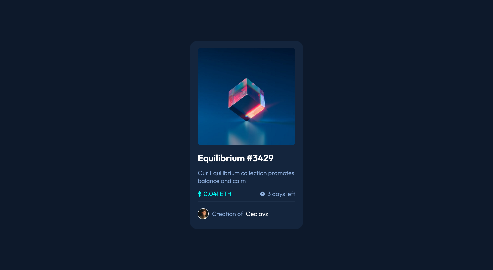

# NFT preview card component

## Table of contents

- [Overview](#overview)
  - [The challenge](#the-challenge)
  - [Screenshot](#screenshot)
- [My process](#my-process)
  - [Built with](#built-with)
  - [Continued development](#continued-development)
  - [Useful resources](#useful-resources)
- [Author](#author)

## Overview

Component built combining grid and flexbox but for the most part grid.

### The challenge

Users should be able to:

- View the optimal layout depending on their device's screen size
- See hover states for interactive elements

### Screenshot

## My process

Structured my HTML file by looking at the design, I first created a wrapper for the GRID and then nested the elements like the image, title and the paragraph. I created a separete div for the price and time so I can use flexbox for the layout, with the pseudo classes I added the icons and also the active modes for the image of the NFT. Improvement can be done to optimize the CSS and make less lines of code. Will work on that.

### Built with

- Semantic HTML5 markup
- CSS custom properties
- Flexbox
- CSS Grid
- Mobile-first workflow

### Continued development

I want to focus more on how to create better grids and also make a better use of pseudo classes for the hover and active states. I need to practice more with the box model to use better the display property and make everything work fine.

### Useful resources

- [Centering on CSS](https://css-tricks.com/centering-css-complete-guide/) - This was very helpful to remember how to center through different patterns.
- [Guide for GRID](https://css-tricks.com/snippets/css/complete-guide-grid/) - Helpful for the grid element, recommended for anyone who wants a refresher or is learning.

## Author

@Geolavz